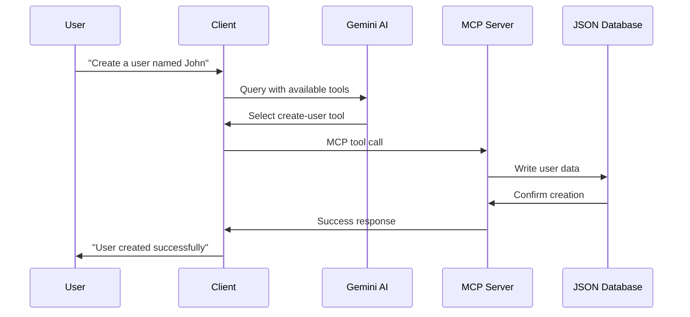

# Model Context Protocol (MCP) Server & Client Integration

---

## 🎯 What is Model Context Protocol (MCP)?

- **Standardized protocol** for AI applications to access external data and tools
- **JSON-RPC based** communication between clients and servers
- **Enables AI models** to interact with databases, APIs, and other resources
- **Secure and structured** way to extend AI capabilities

---

## 🏗️ Project Architecture

```
mcp-server_client/
├── src/
│   ├── server.ts          # MCP Server implementation
│   ├── client.ts          # MCP Client with AI integration
│   └── data/
│       └── users.json     # Sample data storage
├── build/                 # Compiled JavaScript
├── package.json          # Dependencies and scripts
└── tsconfig.json         # TypeScript configuration
```

---

## 🔧 Technology Stack

### Core Dependencies

- **@modelcontextprotocol/sdk** - Official MCP SDK
- **TypeScript** - Type safety and modern JavaScript
- **Node.js** - Runtime environment
- **Zod** - Schema validation

### AI Integration

- **@ai-sdk/google** - Google Gemini AI integration
- **ai** - AI SDK for tool execution
- **@inquirer/prompts** - Interactive CLI prompts

---

## 🖥️ MCP Server Implementation

### Key Components

#### 1. Server Setup

```typescript
const server = new McpServer({
  name: "mcp-server",
  version: "1.0.0",
  capabilities: {
    resources: {}, // Data access
    tools: {}, // Function calls
    prompts: {}, // AI prompts
  },
});
```

#### 2. Tool Definition

```typescript
server.tool(
  "create-user",
  "Create a new user in the database",
  {
    name: z.string().describe("User's name"),
    email: z.string().describe("User's email"),
    address: z.string().describe("User's address"),
    phone: z.string().describe("User's phone number"),
  },
  async (params) => {
    const id = await createUser(params);
    return {
      content: [{ type: "text", text: `User ${id} created successfully` }],
    };
  }
);
```

---

## 📡 Available Server Capabilities

### 🛠️ Tools

1. **example** - Echo tool for testing
2. **create-user** - Create new users with validation
3. **create-random-user** - Generate users with AI assistance

### 📚 Resources

1. **users://all** - Retrieve all users
2. **users://{userId}/profile** - Get specific user details

### 💭 Prompts

1. **generate-dummy-user** - AI prompt for user generation

---

## 🤖 MCP Client Implementation

### Client Architecture

#### 1. MCP Connection

```typescript
const mcp = new Client(
  {
    name: "text-client-video",
    version: "1.0.0",
  },
  { capabilities: { sampling: {} } }
);

const transport = new StdioServerTransport({
  command: "node",
  args: ["build/server.js"],
  stderr: "ignore",
});
```

#### 2. AI Integration

```typescript
const google = createGoogleGenerativeAI({
  apiKey: process.env.GEMINI_API_KEY,
});
```

---

## 🔄 Client-Server Interaction Flow

### 1. Connection Phase

```
Client → Transport → Server
   ↓
Capabilities Exchange
   ↓
Ready for Requests
```

### 2. Tool Execution Flow

```
User Query → AI Model → Tool Selection → MCP Server → Response
```

### 3. Resource Access Flow

```
Client Request → URI Resolution → Data Retrieval → JSON Response
```

---

## 🚀 Getting Started Guide

### 1. Installation

```powershell
# Clone and install dependencies
npm install

# Set up environment variables
# Create .env file with GEMINI_API_KEY
```

### 2. Development Workflow

```powershell
# Build TypeScript
npm run build

# Run server in development
npm run server:dev

# Run client
npm run client:dev

# Debug with inspector
npm run server:inspect
```

---

## 🔍 Server Inspector Integration

### What is MCP Inspector?

- **Web-based debugging tool** for MCP servers
- **Interactive testing** of tools and resources
- **Real-time message inspection**
- **Protocol compliance validation**

### Usage

```powershell
npm run server:inspect
# Opens browser interface for testing
```

---

## 🎯 Claude Desktop Integration

### Configuration Steps

1. **Install Claude Desktop**
2. **Configure MCP Server**
   ```json
   // %APPDATA%\Claude\claude_desktop_config.json
   {
     "mcpServers": {
       "mcp-server": {
         "command": "node",
         "args": ["<ABSOLUTE_PATH>/build/index.js"]
       }
     }
   }
   ```
3. **Restart Claude Desktop**

---

## 🛡️ Security & Best Practices

### Server Security

- ✅ **Input validation** with Zod schemas
- ✅ **Error handling** with try-catch blocks
- ✅ **Type safety** with TypeScript
- ✅ **Structured logging** (stderr for logs, stdout for protocol)

### Client Security

- ✅ **API key management** with dotenv
- ✅ **Connection validation**
- ✅ **Graceful error handling**

---

## 📊 Data Flow Example

### User Creation Workflow



---

## 🔧 Advanced Features

### 1. AI-Powered User Generation

```typescript
server.tool("create-random-user", ..., async () => {
  const response = await server.server.request({
    method: "sampling/createMessage",
    params: {
      messages: [{
        role: "user",
        content: {
          type: "text",
          text: "Generate realistic user data in JSON format"
        }
      }]
    }
  });
  // Process AI response and create user
});
```

### 2. Dynamic Resource Templates

```typescript
server.resource(
  "user-details",
  new ResourceTemplate("users://{userId}/profile"),
  ...,
  async (uri, { userId }) => {
    // Dynamic user lookup based on URI parameter
  }
);
```

---

## 🚦 Error Handling Patterns

### Server-Side

```typescript
async (params) => {
  try {
    const result = await performOperation(params);
    return { content: [{ type: "text", text: result }] };
  } catch (error) {
    console.error("Operation failed:", error);
    return {
      content: [
        {
          type: "text",
          text: `Failed: ${error.message}`,
        },
      ],
    };
  }
};
```

### Client-Side

```typescript
try {
  const response = await mcp.callTool({
    name: tool.name,
    arguments: args,
  });
  console.log(response.content[0].text);
} catch (error) {
  console.error("Tool execution failed:", error);
}
```

---

## 📈 Performance Considerations

### Server Optimization

- **Async/await** patterns for I/O operations
- **JSON streaming** for large datasets
- **Connection pooling** for database access
- **Caching** frequently accessed resources

### Client Optimization

- **Connection reuse** for multiple operations
- **Batch requests** when possible
- **Timeout handling** for long operations

---

## 🧪 Testing Strategy

### Server Testing

```powershell
# Use MCP Inspector for interactive testing
npm run server:inspect

# Manual tool testing
# Resource validation
# Error condition testing
```

### Client Testing

```powershell
# Run client in development mode
npm run client:dev

# Test each interaction type:
# - Tool execution
# - Resource access
# - Prompt handling
# - AI integration
```

---

## 🔮 Extension Opportunities

### Server Extensions

- **Database integration** (PostgreSQL, MongoDB)
- **API proxying** to external services
- **File system operations**
- **Authentication & authorization**

### Client Extensions

- **Multiple AI providers** (OpenAI, Anthropic, etc.)
- **GUI interface** instead of CLI
- **Batch processing** capabilities
- **Configuration management**

---

## 📚 Key Takeaways

### ✅ MCP Benefits

- **Standardized** AI-to-tool communication
- **Type-safe** development with TypeScript
- **Modular** architecture for scalability
- **Secure** data access patterns

### 🎯 Integration Success Factors

- **Clear capability definition**
- **Robust error handling**
- **Comprehensive testing**
- **Good documentation**

---

## 🔗 Resources & References

- [Model Context Protocol Documentation](https://modelcontextprotocol.io/)
- [MCP SDK Documentation](https://github.com/modelcontextprotocol/typescript-sdk)
- [Claude Desktop Integration Guide](https://claude.ai/download)
- [MCP Inspector Tool](https://github.com/modelcontextprotocol/inspector)

---

## ❓ Q&A

**Ready for questions about:**

- MCP protocol implementation
- TypeScript integration patterns
- AI model integration
- Server-client architecture
- Deployment strategies
- Security considerations

---

## 🚀 Next Steps

1. **Experiment** with the provided codebase
2. **Extend** tools and resources for your use case
3. **Integrate** with your preferred AI models
4. **Deploy** to production environment
5. **Contribute** to the MCP ecosystem

---

_Thank you for exploring MCP Server & Client Integration!_
